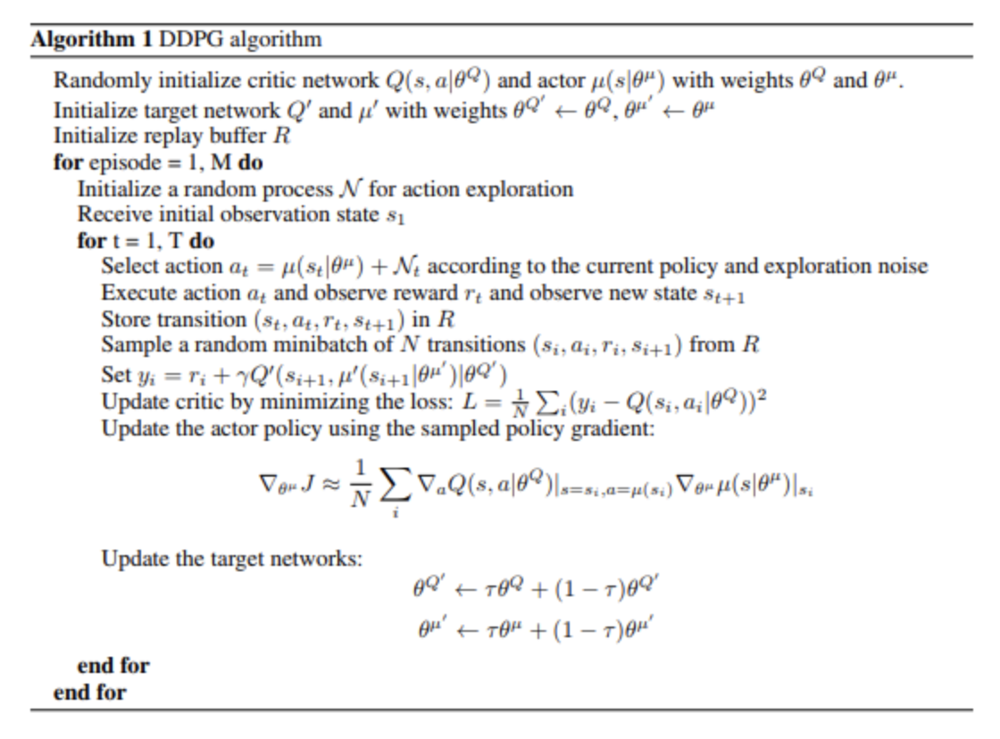
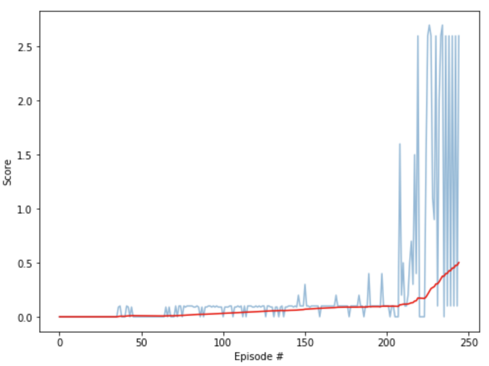

# Navigation Project

This report describes the author's approach to solve the Collaboration and Competition project part of Udacity's [Deep Reinforcement Learning Nanodegree](https://www.udacity.com/course/deep-reinforcement-learning-nanodegree--nd893)

## Project and Environment details

For a detailed description of the project and the environment required to run the files provided, see README.md


## Agent Implementation

### Theory

This project was solved by implementing an Actor-Critic Deep Deterministic Policy Gradient to solve the 20-agent version of the environment provided. The original DDPG paper can be found [here](https://arxiv.org/pdf/1509.02971.pdf) . The Actor network estimates the best action for a given state, and the Critic network uses the Actor's output to estimate the value of an action in a given state. In this implementation, the Actor and the Critic do not share a common network. The solution was built as a modified version of the implementation of DDPG provided for the pendulum environment as part of the DRL course. The DDPG algorithm was implemented with a Replay Buffer and the noise in the process was modeled as a Ornstein-Uhlenbeck process. Both agents learn simultaneously and are controlled by the same policy, yet they are playing against each other. For this reason, this environment can be highly unstable as it requires the correct balance between independent and shared learning to be able to progress while playing against each other. In this implementation, albeit sharing policy, it is allowed for each agent to select their own independent action. Lastly, to avoid instability at latter stages of training, the addition of a noise decay process was implemented.


### Algorithm



Taken from “Continuous Control With Deep Reinforcement Learning” (Lillicrap et al, 2015).

### Implementation

The code consists of the following files:
- Tennis.ipynb : this is a Jupyter notebook which imports the required dependencies, initializes the environment, performs the training and plots the results.
- model.py : the model is implemented as an Actor and a Critic, each with their independent network. The size of the input layer for both networks is defined by the parameter 'state_size', followed by 2 hidden fully connected layers for both the the Actor and the Critic, followed by an output layer with size controlled by the parameter 'action_size'.
- ddpg_agent.py : this file contains three classes, the DDPG Agent itself, the Ornstein-Uhlenbeck Noise and the Replay Buffer. The DDPG Agent class includes several methods, amongst which there is an act() method which returns the action for an input state as per the current policy (with clipping between -1 and +1). The method learn() updates the value parameters of the local neural networks for Critic and Actor and then performs a soft update on the target networks. The Ornstein-Uhlenbeck Noise class models the noise in the process, and the method Agent.reset() reduces the epsilon value (controlled by a decay process) which encourages the selection of actions more likely to yield higher rewards as the learning process develops. The Replay Buffer class stores the experience tuples using a fixed-size buffer.


### Parameters and Results

The following are the hyperparameters used by the DDPG Agent:

```
BUFFER_SIZE = int(1e6)  # replay buffer size
BATCH_SIZE = 512        # minibatch size
GAMMA = 0.99            # discount factor
TAU = 4e-2              # for soft update of target parameters
LR_ACTOR = 5e-4         # learning rate of the actor
LR_CRITIC = 4e-4        # learning rate of the critic
WEIGHT_DECAY = 0.0      # L2 weight decay
```

Moreover, after extensive tests it was identified that the noise, albeit beneficial during early stages of learning, was hindering the capability to learn after a few hundreds of episodes. For this reason, a linear noise decay process was introduced:

```
EPSILON = 1.0           # initial noise
EPSILON_DECAY = 5e-3    # noise decay
```


For this particular case (number of states and actions in the environment), the Actor and Critic use the following architectures:

```
ACTOR and CRITIC
Input nodes (state_size),
Fully Connected Layer (250 nodes, ReLu activation function),
Fully Connected Layer (125 nodes, ReLu activation function),
Ouput nodes (action_size)
```


Given the aforementioned parameters and architecture, these are the results obtained for one of the training sessions by training locally (GPU enabled). The training time was of the order of 25 minutes. The environment was solved in 145 episodes.



In comparison with the Benchmark Implementation provided by Udacity (which solved the environment in around 1500 episodes), this implementation seems acceptable.


### Ideas for future work

There are multiple approaches to implement for future work. On the one hand, further tuning of the hyperparameters could be performed. It was found that the learning rates and the soft update parameter had a very strong influence in the learning behavior for this environment, as well as the noise process and its decay. It is likely that a finer tuning of the hyperparameters can be achieved.  

On the other hand, a different approach could be followed, in which each agent learns a separate policy. This could help reducing the inherent instabilities caused by the same policy being executed by both agents "against" each other.

Moreover, Proximal Policy Optimization (PPO) could be used. Top performance may not be as good, but PPO is supposed to be advantageous due to the ease of tuning compared to DDPG, as suggested by OpenAI [here](https://openai.com/blog/openai-baselines-ppo/). Considering how much tuning this solution required, an implementation which makes use of PPO has the potential to be considerably easier to tune in this environment, however it may not perform as well due to the complexity introduced by the multi-agent environment. 
